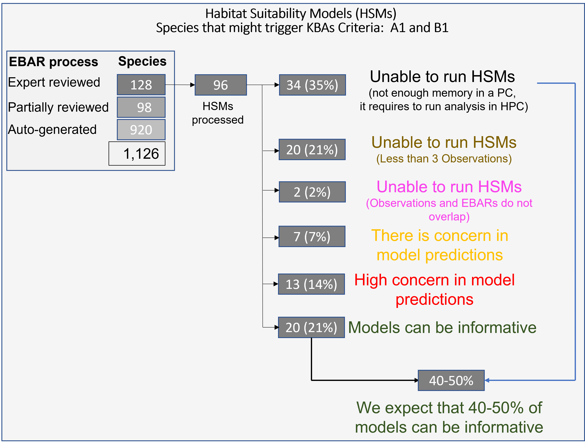

# Implementing habitat suitability models (HSMs) to identify potential areas for Key Biodiversity Areas (KBAs) in Canada

## Planning/developing team
+ Juan Zuloaga (McGill University)
+ Prof. Andrew Gonzalez (McGill University)
+ Ciara Raudsepp Hearne (WCS-KBA Canada coordinator)

## Overview
Screening potential areas for <a href="http://www.kbacanada.org/" target="_blank">Key Biodiversity Areas (KBAs) in Canada</a>, using Habitat Suitability Models (HSMs) for species that might trigger A1 (threatened species) and B1 (geographic restricted species) KBA criteria  (see <a href="https://portals.iucn.org/library/node/46259" target="_blank">KBA standard</a>)

## Scope/extent
- This is an exploratory analysis using coarse resolution datasets (~1km2).
- Canada
- We ran the analysis for a group of 96 species as a proof of concept aimed to provide recommendations for full implementation (~ 1,200 species). 

## General methods
We first evaluated habitat suitability models relating species presence-only data sets and predictor variables, using the  <a href="https://www.sciencedirect.com/science/article/pii/S030438000500267X" target="_blank">Maxent algorithm</a> implemented in the  ENMeval v.2.0.0 package in R (<a href="https://besjournals.onlinelibrary.wiley.com/doi/full/10.1111/2041-210X.13628?campaign=woletoc" target="_blank">Kass et al 2021</a>). Then, we used cluster analysis to identify discrete polygons containing most of the high suitable areas.

## Structure of this report
<a href="[http://www.kbacanada.org/](https://quebio.ca/kba/MAcro_KBAs_HSMs_Sites_Canada.html)" target="_blank">Master document</a>: In this document you will find five sections
- Overview
- Workflow
- Results (summarized below)
- Methods: we provide full description of the methods along with links to papers and websites tha can help future users to implement HSMs.
- **Species reports**: it contains a link to a new html file showing results for every single species included in the analysis. This link is well supported with interactive maps, statistics, figures and tables.  

## Scripts
The main R script is named `KBAsCan_Topdown_v10.R`.  It fully implements the analsysis for any species in Canada. Note that these scripts requiere some addtional work to summarize serveral lines into more practical and elegant functions.

The Markdown file `MacroKBAs_Sites_v4.Rmd` generates a .html file to visualize the master document.

The Markdown files to create the html **species' reports** are:
- `Output_KBAs_v7_empty_v2.Rmd`: it generates a html for those species where is imposible to run HSMs (we specified the reasons e.g., not enough observations).
- `Output_KBAs_v7.Rmd`: it generates a html full report for species with model predictions.

## Data
In this link (data_inputs) you will find a zipped file with environmental layers (.tif files), shapefiles and Excel tables. If you want to download the zipped file setwd("C:/HSMs_KBAsCan") in your PC and unzipped the file to create a `data_input` folder.
- Species: WCS-KBAs provided an Excel table with a set of potential species for analysis.
- Observations: we were granted access to the NatureServe Canada datasets via ArcGIS Pro.

## Software
We used  R (x64 3.6.1) and several packages described in the methods section in the master document.
We also used ArcGis Pro (using an R package) to connect with NatureServe Canada database and retrieve data for the analysis.

## Results/recomendations
The figure below summarizes results obtained after running HSMs for 96 species. 

**1. Unable to run HSMs**

There is a group of species where we were unable to run run HSMs.  We identified three cases:

+ **Computer performance limitations (n=34; 35%)**: we used a PC with 16GB in RAM and ran  HSMs in parallel, using the ENMeval package option. It seems that it is not enough clusters for some species that have a broad geographic extent. Computer crashed after 4-5 hours.  We recommend to move the analysis fr this group of species to a High Performance Computer (HPC). It is likely that this group of species will generate reliable models, because they have good number of observations.

+ **Not enough observations (n=20; 21%)**: HSMs do not run with species with less than 3 observations (at least using th ENMeval package and Maxent Algorithm). We suggest to use alternative ways to inform KBAs initiative, such as: expert knowledge, current observations and/or critical habitat.

+ **Some spatial issues between observations and EBARS (n=2; 2%)**: we were unable to run models for two species. It seems that observations and EBARs are in a different coordinates systems, so they do not overlap. This is something to review with NatureServe.

**2. Species with HSMs predictions**

For this group of species we were able to run HSMs and classified them based on one of the model performance metric "Omission rate (OR)", as follow:
Note: Intermediate results (maps, tables, etc) for each species can be accessed here.
<a href="https://object-arbutus.cloud.computecanada.ca/KBACAN/Intermediate.zip" target="_blank">here - ~365MB</a>

Omission rate (OR) indicates the "fraction of the test localities that fall into pixels not predicted as suitable for the species. A low omission rate is a necessary (but not sufficient) condition for a good model."(<a href="https://www.sciencedirect.com/science/article/abs/pii/S030438000500267X" target="_blank">Phillips et al., 2006 </a>). There is no thresholding rule developed yet to determine the optimal threshold for the omission rate, so we suggest this provisional relative scale (is the model potentially useful?): 

+  **There is high concern (> 0.50) in model predictions (n=13; 14%)**. Most of the species had 3 observations. However, some species with 7-10 observations performed similarly poor. We recommend to let the algorithm run the model (even with 3 observations) and use one of the performance metrics (e.g. OR) to decided model usefulness. We suggest to use alternative ways to inform KBAs initiative, using expert knowledge, current observations and/or critical habitat.

+  **There is some concern (0.25-0.50)` in model predictions (n=7; 7%)**.  This is a group of species with low number of observations (6-13) and intermediate values for OR.  We recommend to treat this species also as a 'concern in model predictions'. We suggest to use alternative ways to inform KBAs initiative, using expert knowledge, current observations and/or critical habitat.

+  **Model predictions can be informative (0.25; n=20; 21%)**: This is a group of species with low to high number of observations (8-47) and high values for OR.  We believe that these models can ofe some relevant information to inform KBAs initiative. We expect that running the group of species with computer performance limitations (n=34; 35%) in a HPC will result in an increase of the percentage of informative models to 40-50%.  The reason: this group of species present huge number of observations. If true, we could expect at least 500 or so informative HSMs for the entire group of ~1,200 species.

## Collaborators

Datasets:
+ Chloé Debyser (KBA Canada Technical Coordinator)
+ Randal Green (NatureServe Canada, Technical Coordinator, EBAR Project)
+ Christine Terwissen (NatureServe Canada, National Coordinator, EBAR Project)

HSMs reviewrs:
+ Maria Leung (Yukon species expert)
+ Richard Schuster (Carleton University)
+ Jacqueline Clare (BC Conservation Data Centre)
+ Varina Crisfield (Sherbrook University)
+ Guillaume Blanchet (Sherbrook University)
+ Dave Fraser 

Coding troubleshooting:
+ Guillaume Larocque (McGill University)
+ Val Lucet (McGill University)
+ Gonzalo Pinilla for ENMeval package (CUNY)
